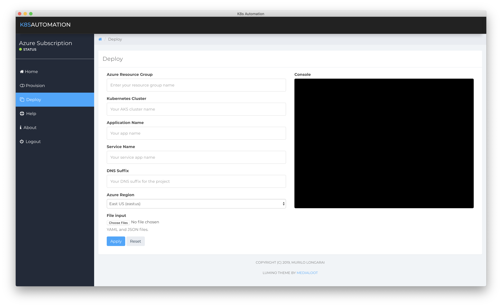

# K8sAutomation 

[](https://travis-ci.com/mlongarai/K8sAutomation)


[](https://github.com/mlongarai/K8sAutomation)


## Overview

Simplify the build of your Azure Kubernetes Service (AKS) cloud infrastructure. Use this app to provision and deploy a kubernetes cluster and and build your microservice architecture quickly and easily.

This is a desktop app was built with [Electron](http://electronjs.org). This app works only macOS operating system.

This project proposes to build a set of routines to accelerate the creation of an ecosystem in the flow of software development, enabling the automation of the construction of an initial environment for approval and testing of the project, seeking to facilitate the configuration, management, and monitoring of the environments through Kubernetes, container orchestrator, provides stability, scalability and centralized maintenance.

### Requirements

* Install Azure CLI:  [Azure CLI for macOS](https://docs.microsoft.com/en-us/cli/azure/install-azure-cli-macos?view=azure-cli-latest)
* Install kubectl:  [kubectl](https://kubernetes.io/docs/tasks/tools/install-kubectl/)

OR

* You can install via brew:

   ```Azure CLI
   brew install azure-cli
   ```
   ```kubectl
   brew install kubernetes-cli
   ```
* Check on terminal:

   ```Check instalation
   az --version
   kubectl version
   ```

* Login Azure Subscription

   ```sh
   az login
   ```

## Getting Started

### Creating a new AKS infrastructure

### Download and Run

* Get latest Release: [Latest](https://github.com/mlongarai/K8sAutomation/releases/latest)

OR

* Do yourself: 

   ```Github
   git clone https://github.com/mlongarai/K8sAutomation.git
   cd K8sAutomation
   npm install
   npm start
   ```

### Provisioning


* Fill out:

   * Name of new Resource Group of Azure
   * Name of new Azure Container Registry
   * Name of new Cluster K8s
   * Number of Cluster Nodes
   * Name of Location
      * [Region availability](https://docs.microsoft.com/en-us/azure/aks/container-service-quotas)
   * Name of VM Size 
      * [Size Spec](https://docs.microsoft.com/en-us/azure/cloud-services/cloud-services-sizes-specs)


And press Apply.

* Console:

You can see all information of provisioning steps on console.

### Deploying



For this step you need to use some example like [api-mongodb-jenkins-example](https://github.com/mlongarai/) for deploy pods, services, deployments, etc.

* Fill out:

   * Name of new Resource Group of Azure
   * Name of new Cluster K8s
   * Name of new App
   * Name of new Service
   * Name of new DNS suffix
   * Name of location provisioned
      * List [Quotas and region availability for Azure Kubernetes Service (AKS)](https://docs.microsoft.com/en-us/azure/aks/container-service-quotas)
      

And press Apply.

* Console:

You can see all information of deploying steps on console.

### Monitoring your Infrastructure

* [Azure Portal](http://portal.azure.com/)
* [Kubernetes Dashboard](https://github.com/kubernetes/dashboard)

### Examples of K8s architecture scenarios

* [api-mongodb-jenkins-example](https://github.com/mlongarai/): API for Documentation using Node.js + MongoDB + Jenkins for CI/CD


### Terminal Experts

* [Azure CLI](https://docs.microsoft.com/en-us/cli/azure/ext/aks-preview/aks?view=azure-cli-latest)
* [kubectl Cheat Sheet](https://kubernetes.io/docs/reference/kubectl/cheatsheet/)

### Deleting the AKS infrastructure (and all associated resources)

* Open the terminal and write:
   ```vim
   az group delete -n MyResourceGroup --no-wait
   ```

## Credits

* Original idea of base code shell script by [Azure Voting App](https://github.com/Azure-Samples/azure-voting-app-redis).
* Original idea of base code electron app by [Electron Run Shell Example](https://github.com/martinjackson/electron-run-shell-example).
* Original idea of base code bootstrap by [Medialoot](https://medialoot.com/themes/).

## Contributors

Special thanks to my friends who helped me solve complex architectural and software development problems in this project.

* @[eduth](https://github.com/eduth)


<p align="center">
  <br>
  <br>
  <b>“Thank you to all who have contributed in this great work”</b><br>
  <br><br>
</p>